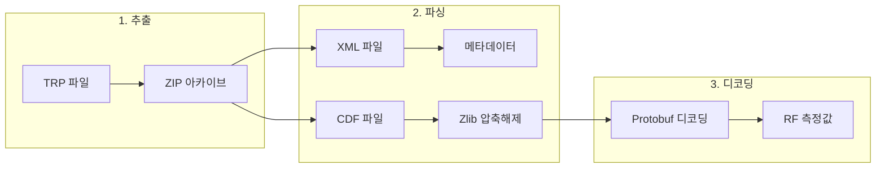

# @gracefullight/tems-trp-parser

> TEMS Pocket TRP (Trace Recording Packet) RF 로그 파일을 파싱합니다.

[](https://www.npmjs.com/package/@gracefullight/tems-trp-parser)
[](https://opensource.org/licenses/MIT)

[English](./README.md) | **한국어**

## 주요 기능

- **독립형 파서** - TEMS Pocket TRP 파일을 직접 파싱하여 RF 측정값 추출
- **CLI & 프로그래밍 API** - 커맨드 라인 또는 애플리케이션에 통합하여 사용
- **다양한 출력 형식** - CSV, JSON, JSONL(줄 단위 JSON)로 내보내기
- **풍부한 메타데이터 추출** - 기기 정보, 타임스탬프, 프로브 버전, 채널 상세 정보
- **LTE/5G 지원** - 서빙 셀, 이웃 셀, MRDC (Multi-RAT Dual Connectivity)
- **스트리밍 아키텍처** - 대용량 TRP 파일의 메모리 효율적 처리
- **완전한 타입 지원** - TypeScript 정의 완비

## 동작 원리



| 단계 | 입력 | 출력 |
|------|------|------|
| **추출** | `.trp` 파일 | ZIP 내용물 |
| **파싱** | XML + CDF | 메타데이터 + 바이너리 스트림 |
| **디코딩** | Protobuf 메시지 | RSRP, RSRQ, SINR, PCI, ... |

## 설치

```bash
# bun 사용 (권장)
bun add @gracefullight/tems-trp-parser

# npm 사용
npm install @gracefullight/tems-trp-parser

# yarn 사용
yarn add @gracefullight/tems-trp-parser
```

## 빠른 시작

### CLI 사용법

```bash
# 메타데이터 표시
tems-trp sample.trp

# JSON 형식으로 메타데이터 표시
tems-trp sample.trp --json

# RF 측정값을 CSV로 내보내기
tems-trp sample.trp --export output.csv

# JSONL(줄 단위 JSON)로 내보내기
tems-trp sample.trp --export output.jsonl

# TRP 아카이브 내 모든 파일 목록
tems-trp sample.trp --list

# 모든 파일을 디렉토리로 추출
tems-trp sample.trp --extract ./output/
```

### JavaScript/TypeScript API

```typescript
import { parse, extract } from "@gracefullight/tems-trp-parser";

// 메타데이터 파싱
const meta = parse("sample.trp");
console.log(`기기 모델: ${meta.deviceInfo.model}`);
console.log(`제조사: ${meta.deviceInfo.manufacturer}`);
console.log(`시작 시간: ${meta.timeInfo.startTime}`);
console.log(`종료 시간: ${meta.timeInfo.stopTime}`);

// RF 데이터를 CSV로 추출 (TRP 파일과 같은 디렉토리)
extract("sample.trp");

// 출력 경로 지정 (확장자에서 형식 추론)
extract("sample.trp", { output: "/output/rf_data.csv" });
extract("sample.trp", { output: "/output/rf_data.jsonl" });

// 출력 디렉토리 지정 (원본 파일명 사용)
extract("sample.trp", { output: "/output" }); // -> /output/sample.csv

// 형식 명시적 지정
extract("sample.trp", { output: "output", format: "jsonl" });
```

## 추출되는 RF 필드

| 카테고리 | 필드 |
|----------|------|
| **LTE 서빙 셀** | RSRP, RSRQ, RSSI, SINR, PCI, EARFCN, Band, Cell Identity |
| **LTE 서빙 셀 RX** | 안테나별 RSRP, RSRQ, RSSI, CINR |
| **LTE 이웃 셀** | RSRP, RSRQ, RSSI, PCI, EARFCN |
| **LTE 셀 통계** | 셀별 PCI, EARFCN |
| **LTE 서빙 시스템** | TAC, MCC, MNC |
| **5G NR (MRDC)** | RSRP, RSRQ, SINR, PCI, Band, Channel |
| **WiFi** | RSSI, Channel, SSID, BSSID |
| **처리량** | UL/DL Throughput (Common, WiFi, Low-level) |

## API 레퍼런스

### `parse(trpPath: string): TRPMetadata`

RF 데이터 처리 없이 TRP 파일의 메타데이터만 추출합니다.

```typescript
const meta = parse("sample.trp");

// 기기 정보
console.log(meta.deviceInfo.manufacturer);  // "samsung"
console.log(meta.deviceInfo.model);         // "SM-G998B"
console.log(meta.deviceInfo.osName);        // "Android"
console.log(meta.deviceInfo.osVersion);     // "13.0"
console.log(meta.deviceInfo.imei);          // 기기 IMEI

// 시간 정보
console.log(meta.timeInfo.startTime);       // Date 객체
console.log(meta.timeInfo.stopTime);        // Date 객체
console.log(meta.timeInfo.timezone);        // "Asia/Seoul"

// 프로브 정보
console.log(meta.probeIdentity);            // "TEMS Pocket"
console.log(meta.probeVersion);             // "28.0.1.123"

// 데이터 채널
meta.channels.forEach(ch => {
  console.log(`${ch.channelId}: ${ch.category} - ${ch.elementCount}개 요소`);
});
```

### `extract(trpPath: string, options?: ExtractOptions): string`

RF 측정값을 CSV/JSON/JSONL 파일로 추출합니다.

```typescript
interface ExtractOptions {
  output?: string;                    // 출력 경로 또는 디렉토리
  format?: "csv" | "json" | "jsonl";  // 출력 형식
}

// 생성된 파일 경로를 반환
const outputPath = extract("sample.trp", { output: "output.csv" });
console.log(`내보내기 완료: ${outputPath}`);
```

### `TRPParser` 클래스

더 세밀한 제어가 필요할 때:

```typescript
import { TRPParser } from "@gracefullight/tems-trp-parser";

const parser = new TRPParser("sample.trp");

// TRP 아카이브 내 모든 파일 목록
const contents = parser.listContents();
console.log(contents);

// 메타데이터 파싱
const metadata = parser.parse();

// 모든 파일을 디렉토리로 추출
parser.extractTo("./output");

// CDF 파일 경로 가져오기
const cdfPaths = parser.getCdfPaths();
console.log(cdfPaths);  // ["trp/.../cdf/data.cdf", ...]

// 채널 로그 경로 가져오기
const logPaths = parser.getChannelLogPaths();
```

### 저수준 함수

고급 사용 사례:

```typescript
import {
  readVarint,
  tryReadVarint,
  decodeZigzag,
  parseField,
  parseAllFields,
  iterLengthPrefixedMessages,
  iterRecordsFromZip,
} from "@gracefullight/tems-trp-parser";

// 바이너리 데이터에서 varint 읽기
const { value, newPos } = readVarint(data, 0);

// varint 읽기 시도 (불완전하면 null 반환)
const result = tryReadVarint(data, 0);

// ZigZag 인코딩된 부호 있는 정수 디코딩
const signed = decodeZigzag(encodedValue);  // 예: 1 -> -1, 2 -> 1

// 단일 protobuf 필드 파싱
const field = parseField(data, 0);
// { fieldNum: 1, wireType: 0, value: 150, endPos: 3 }

// 메시지의 모든 필드 파싱
const fields = parseAllFields(data);
// [[fieldNum, wireType, value], ...]

// 길이 접두 메시지 반복
for (const msgData of iterLengthPrefixedMessages([chunk1, chunk2])) {
  const fields = parseAllFields(msgData);
}

// ZIP에서 RF 레코드 직접 반복
import AdmZip from "adm-zip";
const zip = new AdmZip("sample.trp");
for (const record of iterRecordsFromZip(zip)) {
  console.log(record.timestamp_us, record["LTE.ServingCell.Rsrp"]);
}
```

### 상수

```typescript
import {
  ALL_FIELD_IDS,     // 전체 필드 ID -> 이름 매핑 (360개 이상)
  RF_FIELD_IDS,      // RF 전용 필드 ID -> 짧은 이름 매핑
  SIGNED_FIELD_IDS,  // ZigZag 인코딩을 사용하는 필드 ID 집합
  SIGNED_KEYWORDS,   // 부호 있는 값을 나타내는 키워드
} from "@gracefullight/tems-trp-parser";

// 필드가 부호 있는 인코딩을 사용하는지 확인
if (SIGNED_FIELD_IDS.has(6317)) {
  // RSRP에 ZigZag 디코딩 사용
}

// 필드 이름 가져오기
console.log(RF_FIELD_IDS[6317]);  // "LTE.ServingCell.Rsrp"
console.log(ALL_FIELD_IDS[6317]); // "Radio.Lte.ServingCell[8].Rsrp"
```

### 타입

```typescript
import type {
  TRPMetadata,
  DeviceInfo,
  ChannelInfo,
  TimeInfo,
  RFRecord,
  ExtractOptions,
  OutputFormat,
} from "@gracefullight/tems-trp-parser";
```

## 요구 사항

- Node.js >= 24.0.0
- Bun >= 1.0.0 (권장)

## 개발

```bash
# 저장소 클론
git clone https://github.com/gracefullight/pkgs.git
cd pkgs/packages/tems-trp-parser

# 의존성 설치
bun install

# 테스트 실행
bun test

# 커버리지 포함 테스트
bun test:coverage

# 빌드
bun run build

# 린트
bun lint

# 포맷
bun lint:fix
```

### 프로젝트 구조

```
packages/tems-trp-parser/
├── src/
│   ├── index.ts          # 공개 API 내보내기
│   ├── constants.ts      # 필드 ID 매핑
│   ├── types.ts          # TypeScript 정의
│   ├── extract.ts        # 바이너리 디코딩 & 추출
│   ├── trp-parser.ts     # XML 파싱 & 메타데이터
│   ├── cli.ts            # CLI 구현
│   └── __tests__/        # 테스트 스위트
├── dist/                 # 컴파일된 출력
└── README.md
```

## 배경

TEMS Pocket은 독점적인 TRP (Trace Recording Packet) 파일에 RF 측정값을 기록하는 모바일 네트워크 테스트 애플리케이션입니다. 이 파일은 본질적으로 다음을 포함하는 ZIP 아카이브입니다:

- **XML 메타데이터** - 기기 정보, 타임스탬프, 프로브 버전
- **CDF 바이너리 데이터** - 압축된 protobuf 인코딩 RF 측정값

이 라이브러리는 교육용 목적으로 개발되어 TRP 형식을 파싱하고 RF 데이터를 추출합니다.

## 후원

이 프로젝트가 도움이 되셨다면 커피 한 잔 부탁드립니다!

<a href="https://www.buymeacoffee.com/gracefullight" target="_blank"></a>

또는 스타를 눌러주세요:

```bash
gh api --method PUT /user/starred/gracefullight/pkgs
```

## 라이선스

MIT
