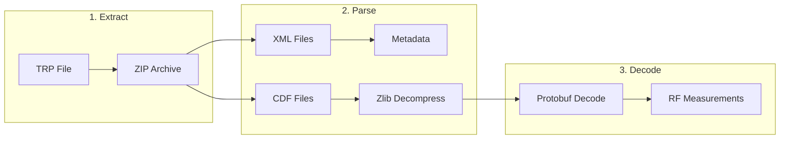

# @gracefullight/tems-trp-parser

> Parse TEMS Pocket TRP (Trace Recording Packet) RF log files.

[](https://www.npmjs.com/package/@gracefullight/tems-trp-parser)
[](https://opensource.org/licenses/MIT)

**English** | [한국어](./README.ko.md)

## Features

- **Standalone Parser** - Parse TEMS Pocket TRP files directly to extract RF measurements
- **CLI & Programmatic API** - Use from command line or integrate into your applications
- **Multiple Output Formats** - Export to CSV, JSON, or JSONL (Newline Delimited JSON)
- **Rich Metadata Extraction** - Device info, timestamps, probe versions, channel details
- **LTE/5G Support** - Serving cell, neighbor cells, MRDC (Multi-RAT Dual Connectivity)
- **Streaming Architecture** - Memory-efficient processing of large TRP files
- **Fully Typed** - Complete TypeScript definitions

## How It Works



| Step | Input | Output |
|------|-------|--------|
| **Extract** | `.trp` file | ZIP contents |
| **Parse** | XML + CDF | Metadata + Binary stream |
| **Decode** | Protobuf messages | RSRP, RSRQ, SINR, PCI, ... |

## Installation

```bash
# Using bun (recommended)
bun add @gracefullight/tems-trp-parser

# Using npm
npm install @gracefullight/tems-trp-parser

# Using yarn
yarn add @gracefullight/tems-trp-parser
```

## Quick Start

### CLI Usage

```bash
# Display metadata
tems-trp sample.trp

# Display metadata as JSON
tems-trp sample.trp --json

# Export RF measurements to CSV
tems-trp sample.trp --export output.csv

# Export to JSONL (Newline Delimited JSON)
tems-trp sample.trp --export output.jsonl

# List all files in TRP archive
tems-trp sample.trp --list

# Extract all files to directory
tems-trp sample.trp --extract ./output/
```

### JavaScript/TypeScript API

```typescript
import { parse, extract } from "@gracefullight/tems-trp-parser";

// Parse metadata
const meta = parse("sample.trp");
console.log(`Device: ${meta.deviceInfo.model}`);
console.log(`Manufacturer: ${meta.deviceInfo.manufacturer}`);
console.log(`Start: ${meta.timeInfo.startTime}`);
console.log(`Stop: ${meta.timeInfo.stopTime}`);

// Extract RF data to CSV (same directory as TRP file)
extract("sample.trp");

// Specify output path (format inferred from extension)
extract("sample.trp", { output: "/output/rf_data.csv" });
extract("sample.trp", { output: "/output/rf_data.jsonl" });

// Specify output directory (uses original filename)
extract("sample.trp", { output: "/output" }); // -> /output/sample.csv

// Specify format explicitly
extract("sample.trp", { output: "output", format: "jsonl" });
```

## Extracted RF Fields

| Category | Fields |
|----------|--------|
| **LTE Serving Cell** | RSRP, RSRQ, RSSI, SINR, PCI, EARFCN, Band, Cell Identity |
| **LTE Serving Cell RX** | Per-antenna RSRP, RSRQ, RSSI, CINR |
| **LTE Neighbor** | RSRP, RSRQ, RSSI, PCI, EARFCN |
| **LTE Cell Statistics** | PCI, EARFCN per cell |
| **LTE Serving System** | TAC, MCC, MNC |
| **5G NR (MRDC)** | RSRP, RSRQ, SINR, PCI, Band, Channel |
| **WiFi** | RSSI, Channel, SSID, BSSID |
| **Throughput** | UL/DL Throughput (Common, WiFi, Low-level) |

## API Reference

### `parse(trpPath: string): TRPMetadata`

Parse TRP file and extract metadata without processing RF data.

```typescript
const meta = parse("sample.trp");

// Device Information
console.log(meta.deviceInfo.manufacturer);  // "samsung"
console.log(meta.deviceInfo.model);         // "SM-G998B"
console.log(meta.deviceInfo.osName);        // "Android"
console.log(meta.deviceInfo.osVersion);     // "13.0"
console.log(meta.deviceInfo.imei);          // Device IMEI

// Time Information
console.log(meta.timeInfo.startTime);       // Date object
console.log(meta.timeInfo.stopTime);        // Date object
console.log(meta.timeInfo.timezone);        // "Asia/Seoul"

// Probe Information
console.log(meta.probeIdentity);            // "TEMS Pocket"
console.log(meta.probeVersion);             // "28.0.1.123"

// Data Channels
meta.channels.forEach(ch => {
  console.log(`${ch.channelId}: ${ch.category} - ${ch.elementCount} elements`);
});
```

### `extract(trpPath: string, options?: ExtractOptions): string`

Extract RF measurements to CSV/JSON/JSONL file.

```typescript
interface ExtractOptions {
  output?: string;                    // Output path or directory
  format?: "csv" | "json" | "jsonl";  // Output format
}

// Returns the path to the created file
const outputPath = extract("sample.trp", { output: "output.csv" });
console.log(`Exported to: ${outputPath}`);
```

### `TRPParser` Class

For more control over parsing:

```typescript
import { TRPParser } from "@gracefullight/tems-trp-parser";

const parser = new TRPParser("sample.trp");

// List all files in TRP archive
const contents = parser.listContents();
console.log(contents);

// Parse metadata
const metadata = parser.parse();

// Extract all files to directory
parser.extractTo("./output");

// Get CDF file paths
const cdfPaths = parser.getCdfPaths();
console.log(cdfPaths);  // ["trp/.../cdf/data.cdf", ...]

// Get channel log paths
const logPaths = parser.getChannelLogPaths();
```

### Low-level Functions

For advanced use cases:

```typescript
import {
  readVarint,
  tryReadVarint,
  decodeZigzag,
  parseField,
  parseAllFields,
  iterLengthPrefixedMessages,
  iterRecordsFromZip,
} from "@gracefullight/tems-trp-parser";

// Read a varint from binary data
const { value, newPos } = readVarint(data, 0);

// Try to read varint (returns null if incomplete)
const result = tryReadVarint(data, 0);

// Decode ZigZag-encoded signed integer
const signed = decodeZigzag(encodedValue);  // e.g., 1 -> -1, 2 -> 1

// Parse a single protobuf field
const field = parseField(data, 0);
// { fieldNum: 1, wireType: 0, value: 150, endPos: 3 }

// Parse all fields in a message
const fields = parseAllFields(data);
// [[fieldNum, wireType, value], ...]

// Iterate over length-prefixed messages
for (const msgData of iterLengthPrefixedMessages([chunk1, chunk2])) {
  const fields = parseAllFields(msgData);
}

// Iterate RF records directly from ZIP
import AdmZip from "adm-zip";
const zip = new AdmZip("sample.trp");
for (const record of iterRecordsFromZip(zip)) {
  console.log(record.timestamp_us, record["LTE.ServingCell.Rsrp"]);
}
```

### Constants

```typescript
import {
  ALL_FIELD_IDS,     // Complete field ID -> name mapping (360+ fields)
  RF_FIELD_IDS,      // RF-specific field ID -> short name mapping
  SIGNED_FIELD_IDS,  // Set of field IDs that use ZigZag encoding
  SIGNED_KEYWORDS,   // Keywords indicating signed values
} from "@gracefullight/tems-trp-parser";

// Check if a field uses signed encoding
if (SIGNED_FIELD_IDS.has(6317)) {
  // Use ZigZag decoding for RSRP
}

// Get field name
console.log(RF_FIELD_IDS[6317]);  // "LTE.ServingCell.Rsrp"
console.log(ALL_FIELD_IDS[6317]); // "Radio.Lte.ServingCell[8].Rsrp"
```

### Types

```typescript
import type {
  TRPMetadata,
  DeviceInfo,
  ChannelInfo,
  TimeInfo,
  RFRecord,
  ExtractOptions,
  OutputFormat,
} from "@gracefullight/tems-trp-parser";
```

## Requirements

- Node.js >= 24.0.0
- Bun >= 1.0.0 (recommended)

## Development

```bash
# Clone repository
git clone https://github.com/gracefullight/pkgs.git
cd pkgs/packages/tems-trp-parser

# Install dependencies
bun install

# Run tests
bun test

# Run tests with coverage
bun test:coverage

# Build
bun run build

# Lint
bun lint

# Format
bun lint:fix
```

### Project Structure

```
packages/tems-trp-parser/
├── src/
│   ├── index.ts          # Public API exports
│   ├── constants.ts      # Field ID mappings
│   ├── types.ts          # TypeScript definitions
│   ├── extract.ts        # Binary decoding & extraction
│   ├── trp-parser.ts     # XML parsing & metadata
│   ├── cli.ts            # CLI implementation
│   └── __tests__/        # Test suites
├── dist/                 # Compiled output
└── README.md
```

## Background

TEMS Pocket is a mobile network testing application that records RF measurements in proprietary TRP (Trace Recording Packet) files. These files are essentially ZIP archives containing:

- **XML metadata** - Device info, timestamps, probe versions
- **CDF binary data** - Compressed protobuf-encoded RF measurements

This library was developed for educational use to parse the TRP format and extract RF data.

## Sponsors

If this project helped you, please consider buying me a coffee!

<a href="https://www.buymeacoffee.com/gracefullight" target="_blank"></a>

Or leave a star:

```bash
gh api --method PUT /user/starred/gracefullight/pkgs
```

## License

MIT
